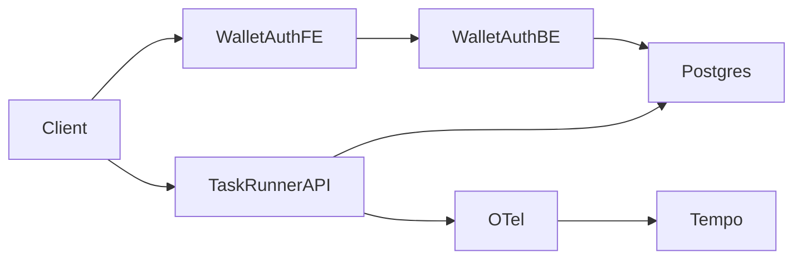

# Threat model (STRIDE)

Living document for **task-runner** and **wallet-auth**. Update when architecture or trust boundaries change.

## System context

## Trust boundaries

1. **Internet / client** → HTTP APIs (task-runner, wallet-auth)
2. **Application** → PostgreSQL
3. **Application** → external APIs (AWS SES, WalletConnect, RPC)
4. **CI/CD** → artifact registry (GHCR)

## STRIDE summary

| Threat | Component | Mitigation (current) |
| ------ | --------- | -------------------- |
| **S** Spoofing | JWT auth | Signed tokens; secret from env not compose |
| **T** Tampering | Task definitions | DB constraints; auth on mutating routes |
| **R** Repudiation | API actions | OTel traces + structured logs to Loki |
| **I** Info disclosure | Logs/metrics | No secrets in logs; Gitleaks in CI |
| **D** Denial of service | task-runner replicas | Multiple replicas; health checks |
| **E** Elevation | Container escape | Non-root Dockerfiles; NetworkPolicy example |

## Agentic / wallet-specific

| Threat | Mitigation |
| ------ | ---------- |
| SIWE replay | Nonce + domain binding in wallet-auth verifier |
| Session fixation | JWT expiry; rotate `JWT_SECRET` per environment |
| SSRF from webhooks | Validate outbound URLs; egress allowlists in production |

## Open items

- [ ] Rate limiting on public API routes
- [ ] mTLS between services in Kubernetes
- [ ] Falco rules for anomalous process/network in cluster
